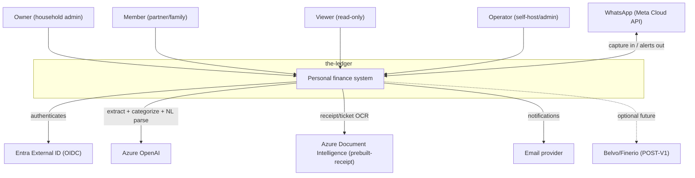

# the-ledger — Architecture

> Concrete, buildable architecture for the v1 backlog (8 epics / 11 features),
> extended in **v1.1** with epic 9 *AI Capture & Channels* (4 features: receipt
> OCR, WhatsApp, NL quick-add, capture UX).
> Complies with the enterprise guardrails; every non-default choice carries an ADR
> in [DECISIONS.md](DECISIONS.md). Stack: **.NET 10 + Aspire** backend, **Vite +
> React + TS + shadcn/Tailwind** PWA frontend, **MAF** for agentic features,
> **PostgreSQL**, **Terraform + GitHub Actions**, on **Azure Container Apps**
> (scale-to-zero). Cloud-specific code is partitioned behind `Infrastructure.Azure`.
> v1.1 adds **Azure Document Intelligence** (`prebuilt-receipt`, ADR-0009) and a
> **WhatsApp** connector (Meta Cloud API behind the connector contract, ADR-0010).

## Context (C4 L1)

External actors and the system as a single box. Diagram: [`docs/diagrams/c1-context.mmd`](docs/diagrams/c1-context.mmd).



Actors: **Owner / Member / Viewer** (household users) and **Operator** (instance admin). External systems: **Entra External ID** (identity), **Azure OpenAI** (statement extraction, categorization, NL quick-add parsing), **Azure Document Intelligence** (receipt/ticket OCR — v1.1), an **email provider**, **WhatsApp** (bidirectional capture + alerts — v1.1), and the **deferred** Belvo/Finerio aggregation connector (post-v1).

## Containers (C4 L2)

Each is an Aspire resource. Diagram: [`docs/diagrams/c2-containers.mmd`](docs/diagrams/c2-containers.mmd).

| Container | Tech | Notes |
|---|---|---|
| **Web SPA** | React + Vite + TS + shadcn/Tailwind | Installable PWA, mobile-first. Served as static assets behind the API/Front Door. |
| **API service** | .NET 10 minimal APIs | Stateless; scales to zero (min replicas 0–1, see ADR-0001). |
| **Parse/Outbox Worker** | .NET worker service | Drains the queue: statement parsing, LLM calls, email. KEDA queue-scaled from zero (ADR-0005). |
| **PostgreSQL** | Azure DB for PostgreSQL Flexible Server | Operational data + append-only audit + outbox tables. |
| **Redis** | Azure Cache for Redis | Idempotency replay, rate-limit windows, session/cache. |
| **Blob Storage** | Azure Blob | Encrypted statement files; card numbers already redacted before persistence. |
| **Queue** | Azure Storage Queue | Parse jobs + outbox dispatch. |
| **Azure OpenAI** | gpt-4o class | Extraction + categorization + NL quick-add parse, called only from the worker/handlers, behind PII redaction. |
| **Azure Document Intelligence** | `prebuilt-receipt` | Receipt/ticket OCR → structured fields; called from the worker behind `IReceiptExtractor` (ADR-0009). v1.1. |
| **Entra External ID** | CIAM | OIDC; email/password + social (ADR-0006). |
| **Key Vault** | — | Secrets via Managed Identity; never in appsettings. |
| **Email connector** | Azure Communication Services | `Infrastructure.Connectors.Email`, outbound only. |
| **WhatsApp connector** | Meta WhatsApp Business Cloud API | `Infrastructure.Connectors.WhatsApp`, inbound webhook (verify + HMAC) + outbound send via outbox (ADR-0010). v1.1. |

The Aspire **AppHost** composes API + Worker + Postgres + Redis + Blob + Queue locally (Azure emulators/containers) and wires the same topology in production via the Terraform output.

## Components (C4 L3) — API service

Diagram: [`docs/diagrams/c3-components-api.mmd`](docs/diagrams/c3-components-api.mmd). The API hosts versioned minimal-API endpoint groups → application handlers (per bounded context) → MAF agents + Infrastructure adapters, all behind a middleware pipeline (tenant resolver → auth → Problem Details → idempotency → rate limiting → audit).

## Solution layout

Shape only; the concrete backbone is scaffolded by `/development:dotnet-aspire-base` + `/architecture:dotnet-architecture`.

```
src/
  TheLedger.AppHost/                      ← Aspire AppHost (resource composition)
  TheLedger.ServiceDefaults/              ← OTel + health checks + Polly resilience
  TheLedger.Api/                          ← minimal APIs grouped by bounded context
  TheLedger.Worker/                       ← queue-driven parse + outbox dispatcher
  TheLedger.Application/                  ← shared application services (CQRS handlers base, behaviors)
  TheLedger.Application.Foundations/      ← epic 1: tenancy, RBAC, audit, export/delete
  TheLedger.Application.Ingestion/        ← epic 2 + epic 9 capture: statements, parsing, receipt OCR, NL quick-add
  TheLedger.Application.Ledger/           ← epic 3: accounts, transactions, categorization
  TheLedger.Application.Budgeting/        ← epic 4: budgets, goals
  TheLedger.Application.Insights/         ← epic 5: net worth, reports, export
  TheLedger.Application.Alerts/           ← epic 6: recurring, bills, anomalies
  TheLedger.Domain/                       ← entities, value objects, domain events
  TheLedger.Infrastructure/               ← EF Core, outbox, tenancy filters, redaction, agent adapters
  TheLedger.Infrastructure.Azure/         ← Blob, Queue, Key Vault, Azure OpenAI, ACS email, Document Intelligence impls
  TheLedger.Infrastructure.Connectors.Email/     ← email connector (registry contract)
  TheLedger.Infrastructure.Connectors.WhatsApp/  ← WhatsApp connector — inbound webhook + outbound send (epic 9, registry contract)
  TheLedger.Web/                          ← Vite SPA (PWA)
tests/
  one test project per source project; integration tests use Testcontainers (Postgres, Redis, Azurite)
```

Module → epic traceability: each `Application.<Context>` maps 1:1 to a PLAN epic; AI categorization (epic 7) is an `ICategorizer` LLM implementation inside `Infrastructure` swapped behind the Ledger context; Shared Household (epic 8) extends Foundations + Budgeting (no new project). **AI Capture & Channels (epic 9)** adds receipt OCR + NL quick-add into `Application.Ingestion` (both produce *staged* transactions in the existing review-and-confirm queue), the Document Intelligence adapter into `Infrastructure.Azure` (behind `IReceiptExtractor`), and one new connector project `Infrastructure.Connectors.WhatsApp` registered via the existing `ConnectorRegistry`.

## Cross-cutting wiring

Every guardrail item has a concrete implementation:

- **AuthN**: Entra External ID via OIDC; API validates JWT bearer; SPA uses MSAL (auth code + PKCE).
- **RBAC**: PLAN policy names (`Households.Manage`, `Transactions.Edit`, `DataSubject.Execute`, …) as ASP.NET Core authorization policies in `Foundations`; roles (owner/member/viewer/operator) bound in config, resolved from token claims. UI gates on the same policy names.
- **Multi-tenancy**: `tenantId` resolved from the token's tenant/household claim into an `ITenantContext` (scoped); enforced by EF Core **global query filters** on every tenant-owned entity; every write stamps `tenantId` (ADR-0003).
- **Observability**: OpenTelemetry via Aspire `ServiceDefaults` → Azure Monitor / App Insights (OTLP). Health checks (`/health`, `/alive`) on API + Worker. **Append-only audit**: `AuditEntry` written on every domain mutation to a separate audit table/connection, with `[Pii]` before/after capture.
- **Resilience**: Polly standard resilience handlers on all outbound calls (Azure OpenAI, Blob, Queue, email, IdP JWKS).
- **Caching**: Redis — idempotency replay records (24h), per-tenant + per-endpoint rate-limit windows, and short-TTL read caches (e.g. categories).
- **Background work**: single in-process scheduler in the Worker for scheduled jobs (nightly recurring sweep, daily net-worth snapshot, bill reminders); **outbox** table drains via the queue for all external side effects (email, LLM) — no fire-and-forget from handlers.
- **Idempotency**: `Idempotency-Key` header required on non-GET writes; replay records in Redis with a 24h window; duplicate key returns the stored response.
- **Config & secrets**: `IOptions<T>` validated at startup (`ValidateOnStart`); secrets from Key Vault via Managed Identity.
- **Compliance**: `/api/v1/data/export` (GDPR/ARCO portability) and `/api/v1/data/delete` (per-tenant erasure) in Foundations; `[Pii]` attribute flows through audit + export; `ConsentRecord` captures aviso-de-privacidad + LLM opt-in + channel opt-in.
- **Channels & capture (v1.1)**: every capture surface (PDF/CSV, receipt photo, WhatsApp, NL quick-add) converges on one `StagedTransaction` review-and-confirm queue — nothing posts to the ledger without user confirmation. Receipt OCR (Azure Document Intelligence) and WhatsApp media handling run in the **Worker** via the **outbox** (external calls); inbound WhatsApp is verified at the edge (subscription challenge + HMAC of the request body against the app secret) before any processing, and the sender phone number must map to an opted-in `User` or it gets a generic help reply (no tenant data leaks to unknown numbers). PAN masking + PII redaction apply before persistence on every path, identical to statement ingestion (ADR-0002). WhatsApp is one more `IChannel` connector in the `ConnectorRegistry`; outbound alerts (bill-due/anomaly/export-ready) fan out to email and/or WhatsApp per the user's channel opt-in.

## Cloud topology

- **Provider**: Azure (single cloud; code cloud-agnostic behind `Infrastructure.Azure`).
- **Compute**: Azure Container Apps environment — API (min 0–1 replicas, scale-to-zero) and Worker (KEDA Azure-queue scaler, scale-to-zero) (ADR-0001, ADR-0005).
- **Data**: Azure DB for PostgreSQL Flexible Server (Burstable tier for v1).
- **Vector**: none in v1 — categorization is direct LLM, merchant memory is a rules table; pgvector deferred (ADR-0008).
- **Files**: Azure Blob Storage, server-side encryption; private container per tenant prefix.
- **Secrets**: Azure Key Vault, Managed Identity (no connection strings in config).
- **Identity**: Entra External ID (CIAM tenant).
- **AI**: Azure OpenAI (regional, MX-data-residency-aware region, e.g. East US 2 / or available region; confirm residency, see ADR-0002 consequences).
- **Edge/CDN**: Azure Front Door (TLS, caching SPA assets, WAF). Optional for v1; Container Apps ingress suffices initially.
- **Networking**: Container Apps environment with VNet integration; private endpoints for Postgres, Redis, Blob, Key Vault; Azure OpenAI via private endpoint or service firewall.
- **IaC**: Terraform (azurerm). **CI/CD**: GitHub Actions with OIDC federated credentials (no stored cloud secrets).

## Data model (concrete)

EF Core 10, code-first, one `LedgerDbContext`. Every tenant-owned entity implements `ITenantOwned { Guid TenantId }` with a global query filter; `Guid` keys (sequential GUIDs). PII fields carry `[Pii]`.

| Entity | Key fields | Tenancy / PII |
|---|---|---|
| `Tenant` (Household) | Id, Name, Plan, CreatedAt | tenancy root |
| `User` | Id, TenantId, Email[Pii], DisplayName[Pii], Role, ExternalAuthId | tenant-owned |
| `Account` | Id, TenantId, Name, Type, Institution, Currency, MaskedNumber[Pii], CurrentBalance | tenant-owned |
| `Statement` | Id, TenantId, AccountId, SourceType, FileRef[Pii], Period, Status, UploadedBy | tenant-owned; file in Blob |
| `Transaction` | Id, TenantId, AccountId, StatementId?, Date, Description[Pii], Amount, Currency, Direction, CategoryId, AttributedUserId?, IsRecurring, CategorizationSource, Confidence | tenant-owned |
| `Category` | Id, TenantId?, Name, ParentId?, Kind | TenantId null = system default |
| `CategorizationRule` | Id, TenantId, MatchPattern, CategoryId, Priority | tenant-owned |
| `Budget` | Id, TenantId, CategoryId, PeriodMonth, TargetAmount, Rollover | tenant-owned |
| `Goal` | Id, TenantId, Name, TargetAmount, CurrentAmount, TargetDate?, LinkedAccountId? | tenant-owned |
| `RecurringSeries` | Id, TenantId, Merchant, Cadence, ExpectedAmount, NextExpectedDate | tenant-owned |
| `Alert` | Id, TenantId, Type, TransactionId?, Status, CreatedAt | tenant-owned |
| `ConsentRecord` | Id, TenantId, UserId, Type, Version, GrantedAt | tenant-owned, compliance |
| `AuditEntry` | Id, TenantId, UserId, Action, EntityType, EntityId, Before, After, Timestamp | append-only, separate table |
| `OutboxMessage` | Id, TenantId, Type, Payload, Status, Attempts, CreatedAt | drives external side effects |

**Migrations**: `dotnet ef` migrations committed; idempotent SQL scripts for deploy; money stored as `decimal(19,4)` + ISO currency code (MXN default, multi-currency-ready). Amounts never `float`.

## API surface (concrete)

- **Versioning**: URL segment `/api/v1/...`.
- **Groups**: `/households`, `/members`, `/consent`, `/accounts`, `/transactions` (incl. `POST /transactions/quick-add` → NL draft), `/categories`, `/statements`, `/receipts` (v1.1: `POST` multipart image → staged txn via Document Intelligence), `/budgets`, `/goals`, `/insights`, `/export`, `/alerts`, `/assistant`, `/connectors` (incl. `GET|POST /connectors/whatsapp/webhook`, v1.1), `/data` (export/delete), `/operator` (admin).
- **Webhook auth exception**: `/connectors/whatsapp/webhook` is unauthenticated by JWT (it's called by Meta) but gated by the subscription verify-token (GET) and HMAC-SHA256 body signature (POST); it is exempt from the `Idempotency-Key` requirement but dedupes on the WhatsApp message id instead.
- **Errors**: Problem Details (RFC 7807) everywhere.
- **Writes**: `Idempotency-Key` header required on POST/PUT/PATCH/DELETE; 24h replay window in Redis.
- **Rate limits**: per-tenant token bucket (default 100 req/min) + stricter per-endpoint on uploads (`/statements`: 10/min) and LLM-backed routes.
- **CORS**: explicit allow-list (SPA origin); no production wildcards.
- **Auth**: every endpoint maps to an RBAC policy; `[Authorize(Policy=...)]`.

## MAF agents

All agentic features use MAF (`Microsoft.Agents.AI` on MEAI `IChatClient` → Azure OpenAI). Conversations persisted in Postgres.

- **LedgerAssistant** — the dashboard slide-over chatbot. Tools: `QueryTransactions`, `GetBudgetStatus`, `GetNetWorth`, `ExplainSpending` (all tenant-scoped, read-only). System prompt: a careful personal-finance assistant that answers only from the user's own data, never gives regulated financial advice, never moves money. Conversation history persisted per user.
- **StatementExtractionAgent** — turns extracted PDF text into structured transactions. Structured output (schema-validated rows: date, description, amount, direction). Per-bank format hints injected. Runs in the Worker; input is redaction-aware (PANs masked before persistence).
- **CategorizationAgent** — categorizes a batch of low-confidence transactions (after the rules fast-path). Input is PII-redacted merchant strings; output is `{categoryId, confidence}` per transaction; corrections feed back into `CategorizationRule` (ADR-0004).
- **ReceiptNormalizationAgent** (v1.1) — takes the structured fields Azure Document Intelligence returns from a receipt/ticket (`prebuilt-receipt`: merchant, transaction date/time, total, tax, line items) and normalizes the messy Mexican merchant string + proposes a category by reusing `ICategorizer`. Structured output `{merchant, date, amount, currency, categoryId, confidence, lineItems[]}`. Runs in the Worker after OCR; low-confidence fields flagged for review. Document Intelligence does the OCR (not the LLM) — see ADR-0009.
- **QuickAddParserAgent** (v1.1) — parses a free-text/dictated phrase ("comí 350 en restaurante ayer", "gasté 200 en el Oxxo") into a transaction draft. Structured output `{amount, currency, date (resolved relative to today in America/Mexico_City), direction, merchant, categoryId, confidence}`; PII-redaction before the call; the draft is **never persisted without explicit user confirmation**. Shared by the SPA quick-add bar and inbound WhatsApp text (ADR-0011).

## SPA architecture

- **Build**: Vite + React + TypeScript; **PWA** (installable, offline-light shell) via `vite-plugin-pwa` (ADR-0007).
- **Routing**: React Router (file-ish feature routes).
- **Server state**: TanStack Query; **client state**: minimal (Zustand for UI/session, e.g. tenant switch).
- **Components**: shadcn/ui primitives (owned/copied), shared `DataTable` (TanStack Table), shared `Form` (react-hook-form + zod). Dashboard chrome: sidebar nav + top bar (tenant/household switch + user menu); the LedgerAssistant chatbot is a persistent slide-over panel.
- **Mobile-first**: every primary flow designed at <480px first; bottom-nav on mobile, sidebar on desktop; statement upload supports the device camera/file picker.
- **Capture UX (v1.1, epic 9)**: a persistent **quick-add bar** (free text → `POST /transactions/quick-add` → parsed draft shown for confirm/edit) reachable from every page; **camera/file receipt capture** (`<input capture="environment">`) → `POST /receipts` with OCR progress; a unified **Review & confirm** queue page surfacing every staged transaction (PDF/CSV/receipt/WhatsApp/quick-add) with inline edit + category accept/override + confirm/reject and optimistic updates; an **Integrations** page entry for WhatsApp (status + per-user opt-in). The smooth-data-entry mandate ("introduce data easily") is this feature.
- **Feature folders**: one per bounded context (`features/ledger`, `features/budgets`, `features/statements`, `features/capture`, …).
- **Auth**: MSAL (auth code + PKCE) against Entra External ID.

## Diagrams checked into the repo

- [`docs/diagrams/c1-context.mmd`](docs/diagrams/c1-context.mmd)
- [`docs/diagrams/c2-containers.mmd`](docs/diagrams/c2-containers.mmd)
- [`docs/diagrams/c3-components-api.mmd`](docs/diagrams/c3-components-api.mmd)
- [`docs/diagrams/c3-components-capture.mmd`](docs/diagrams/c3-components-capture.mmd) (v1.1 — capture & channels flow)

See [DECISIONS.md](DECISIONS.md) for ADR-0001 … ADR-0011.
